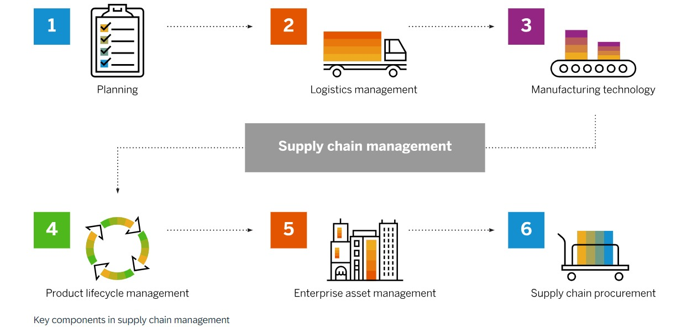

# Optimizing Supply Chain Logistics: Data Visualization and Cost Minimization Strategies

## Overview

Welcome to the Optimizing Supply Chain Logistics project! This repository houses the code and resources for a project focused on optimizing supply chain logistics by leveraging data visualization and cost minimization strategies. The primary objective is to develop a robust framework that addresses various constraints such as product availability, customer assignments, and freight rates to streamline supply chain operations.

## Project Structure

### 1. Description

The core of this project revolves around visualizing and optimizing supply chain networks. It provides an interactive platform to explore the dynamics of order fulfillment and cost minimization within the supply chain.

#### **About the Project**

The project aims to map out the supply chain network using interactive visualization tools, highlighting key nodes and connections. It also delves into order fulfillment strategies and cost minimization approaches, offering a comprehensive view of the supply chain's operational dynamics.

Key features include:
- **Network Analysis**: Visualize supply chain networks to identify critical nodes and potential bottlenecks.
- **Constraint Management**: Incorporate product and customer constraints to ensure feasible order fulfillment.
- **Decision-Making Support**: Provide a data-driven framework for selecting the best facilities for order processing.

#### **Constraints**

- **Product Constraints:** \( P(i) = \{p \in \text{Products} \,|\, Pi \, \text{can produce } p\} \)
- **Customer Constraints:** \( C(j) = \{Pi \, \in \, \text{Plants} \,|\, Pi \, \text{can serve } Cj\} \)
- **Combined Constraints:** \( F(o) = \{Pi \in \text{Plants} \,|\, p \in P(i)\} \cap C(j) \)

#### **Visualization**

Visualizations are central to this project, providing insights into:
- Products manufactured by each plant.
- Manufacturing costs associated with each plant.
- Decision space for handling orders, including potential facility bottlenecks.

### 2. Cost Minimization

This section allows users to explore cost minimization strategies by selecting specific plants and ports. The tool calculates and displays the minimum costs associated with different combinations, helping identify the most cost-effective options for order fulfillment.

### 3. Key Findings

Some of the significant findings from the project include:
- **Cost Minimization**: Identification of cost-effective plant and port combinations for order fulfillment.
- **Decision-Making Support**: A systematic approach to decision-making that goes beyond intuition.
- **Constraint Management**: Effective management of product and customer constraints.
- **Strategic Planning**: Insights for future strategic investments and supply chain improvements.
- **Scalability and Adaptability**: The model’s ability to scale and adapt to changing supply chain demands.

### 4. Future Improvements

The project outlines several areas for future enhancement:
- **Incorporate Real-Time Data**: Use real-time data for dynamic decision-making.
- **Broader Constraint Considerations**: Include additional constraints like labor availability and regulatory requirements.
- **Multi-Objective Optimization**: Balance cost minimization with objectives like delivery time reduction.
- **Expand Network Analysis**: Include more detailed network analysis such as traffic patterns and transportation mode availability.
- **Continuous Improvement Loop**: Regularly update the model with new data for ongoing optimization.

## About Me

I am a first-year MSc student in Applied Statistics at Symbiosis Statistical Institute, Pune. My academic background includes a BSc in Applied Statistics and Analytics from DAVV, Indore. My passion lies in leveraging data to drive insights and support data-driven decision-making in various industries.

I thrive in environments that challenge my analytical and problem-solving skills. Outside of academics, I enjoy playing cricket and dancing, activities that keep me active and bring balance to my life.

Feel free to connect with me on [LinkedIn](https://www.linkedin.com/in/kathanshi-jain/), check out my other projects on [GitHub](https://github.com/Kathanshi0402), or explore my work on [Kaggle](https://www.kaggle.com/kathanshijain).
